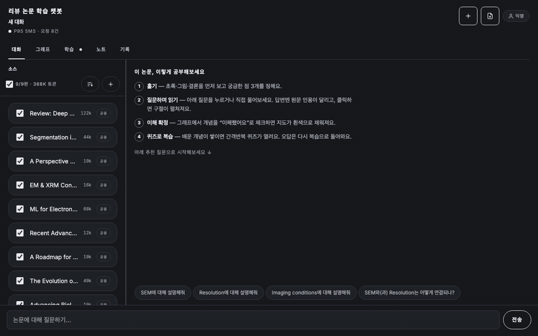

# 리뷰 논문 학습 챗봇

[](https://github.com/alstmdqls03-ux/reviewPaper/actions/workflows/ci.yml)

**논문에 질문하면 근거가 붙고, 각주를 누르면 그 쪽 원문이 열린다. 공부한 개념만 지도에서 자란다.**

전자현미경 리뷰 논문 9편을 컨텍스트에 넣고, 문장별 인용으로 답하는 학습 도구.
FastAPI + Claude · 빌드 없는 단일 HTML · 키 없이 전 기능 구동.



*질문 → 각주 `[1]` → 원문 3/41쪽에서 인용 강조 → 그래프에 개념이 자람 → 개념 위키.
위 화면은 실제 동작이며 `MOCK_LLM=1`(키 없음)로 녹화했다.*

```bash
git clone https://github.com/alstmdqls03-ux/reviewPaper.git && cd reviewPaper
python fetch_papers.py && pip install -r requirements.txt
MOCK_LLM=1 python app.py            # http://localhost:8000
```

## 지금 무엇이 진짜인가

키 없이 도는 MOCK 모드가 기본이다. 무엇이 실동작이고 무엇이 고정 문구인지 먼저 밝힌다.

| | MOCK (키 없음) | 실키 |
|---|---|---|
| 논문 등록·PDF 텍스트 추출·BM25 질문별 선택 | ✅ 실제 | ✅ |
| 소스 선택·그래프 성장·숙련도·퀴즈 채점·노트·대화 재개 | ✅ 실제 | ✅ |
| 원문 뷰어가 여는 쪽·강조되는 인용 구절 | ✅ 실제 그 쪽의 문장 | ✅ |
| **답변 문구** | ❌ 고정 (`[데모 응답] …`) | ✅ 논문에서 생성 |
| **각주가 가리키는 쪽 번호** | ❌ 임의 | ✅ API가 보증 |

실키 경로는 아직 검증되지 않았다 — 무엇이 왜 미검증인지는
[벤치마크 갭 분석](docs/benchmark-gap.md)에 남겨 뒀다.

## 읽어볼 것

기능보다 이 문서들이 볼 만하다.

| 문서 | 무엇이 적혀 있나 |
|---|---|
| [회고 v1–v5](docs/retrospective-v1-v5.md) | 내 코드를 남의 코드로 보고 쓴 회고. MOCK으로만 검증한 경로 7개, **사람 눈으로 본 적 없던 화면 4개**를 실측과 함께 |
| [벤치마크 갭 분석](docs/benchmark-gap.md) | NotebookLM과 비교한 **자기 결함 21건** → **19건 해소**(커밋 해시 표시), 남은 2건은 실키 없이 판정 불가 |
| [DB 스키마](docs/db-schema.md) | `corpus.json` → SQLite 이관. JSON은 40스레드 동시 등록에서 11/40만 살아남고 파일이 깨졌다 |
| [1년 로드맵](docs/roadmap-1y.md) | 분기별 계획, 비용 공식, **정직한 실패 경계 6개** |
| [멀티페이지 UI 설계](docs/2026-07-24-multipage-uiux-design.md) | 왜 진짜 페이지 전환을 쓰지 않았나 (라이브 그래프·스트림 파괴) |
| [데모 배포](docs/deploy-demo.md) | 키 없이 도는 공개 데모를 올리는 법 (`render.yaml` / `fly.toml`) |

## 핵심 기능

- **근거 인용 답변 (스트리밍)** — 실시간 스트리밍 + 문장별 원문 논문·페이지 네이티브 Citations (환각 인용 불가)
- **위키형 개념 그래프** — 개념→관련개념→근거논문 탐색, 답변이 다룬 개념 자동 하이라이트, **내 숙련도(new/learning/known)로 노드 색칠**
- **개인 학습 추적** — 디바이스별 **개념 숙련도**, 약한/복습기한 개념을 **간격반복(SM-2-lite)**으로 우선 출제, **"다음에 공부할 개념"** 가이드 경로, 답변→**노트** 저장→**Markdown 내보내기**
- **개념 퀴즈** — 대화가 쌓이면 열림, 다룬 개념 4지선다 → **서버 채점** → 오답은 그래프 개념으로 "복습" 연결, 결과가 숙련도에 반영
- **계정 + 대화 기록** — 익명 계정(닉네임 지정 가능), 대화가 **영속화되어 재개 가능**(다시 열면 문맥까지 복원), 대화 목록/삭제
- **코퍼스 확장** — 논문 5편 제한 해제, **사용자 PDF 업로드**, 규모 커지면 **BM25 하이브리드 검색**으로 질문별 관련 논문만 컨텍스트 투입, 그래프 재생성
- **운영/품질** — 세션별 격리·TTL, **레이트리밋**(디바이스별 토큰버킷), 입력 검증, 구조화 로깅+`/metrics`, 학습 **분석**(`/analytics`), 헬스체크(`/healthz`·`/readyz`), 골드셋 평가 게이트·인젝션 테스트·CI·**Docker**

## 실행 (자세히)

```bash
# 시드 논문 PDF는 저장소에 없다 (재배포 불가 1편, 비상업 1편 — papers/SOURCES.md).
python fetch_papers.py              # arXiv에서 9편 받기, 표준 라이브러리만 사용

pip install -r requirements.txt

# (A) 오프라인 데모 — API 키 불필요, 전 기능 mock 구동
MOCK_LLM=1 python app.py            # http://localhost:8000

# (B) 실제 모드
cp .env.example .env                # ANTHROPIC_API_KEY (+ 프로덕션은 APP_SECRET, ADMIN_TOKEN)
python app.py

# (C) Docker
docker compose up --build           # /healthz 헬스체크 포함, ./data 에 DB 영속화
```

## 검증

```bash
# 단위 self-check (전부 stdlib, 키 불필요)
make selfcheck                       # session·mastery·corpus·obs·accounts·history·config·limits·analytics
pytest -q                            # 세션·그래프·인젝션

# 통합 (서버 자동 기동)
./ci.sh                              # pytest + eval_gold 게이트(PASS/FAIL) + injection

# 서버 띄운 상태:
MOCK_LLM=1 python eval.py            # 근거성/충실도 리포트
MOCK_LLM=1 python eval_gold.py       # 골드셋 게이트
locust -f locustfile.py --host http://127.0.0.1:8000 --headless -u 20 -r 10 -t 20s   # 동시성·세션격리
```

`make` 타깃: `run mock test ci eval load selfcheck docker-build docker-up docker-down clean`.

## HTTP API

| 엔드포인트 | 설명 |
|---|---|
| `POST /chat` | SSE 스트리밍 답변+인용. `{session_id, conversation_id, message}`, 헤더 `X-Device-Id` |
| `POST /quiz` · `POST /quiz/grade` | 간격반복 퀴즈 생성 / 서버 채점 |
| `GET /mastery` | 숙련도 + 다음에 공부할 개념 |
| `POST/GET /notes` · `GET /notes/export` | 노트 저장/목록/Markdown 내보내기 |
| `GET/POST /account` · `/account/name` | 익명 계정 조회/닉네임 |
| `GET /conversations` · `GET/DELETE /conversations/{id}` | 대화 기록 목록/재개/삭제 |
| `POST /upload` | 논문 PDF 추가 |
| `GET /metrics` · `GET /analytics` | 요청 메트릭 / 학습 분석(ADMIN_TOKEN 게이트) |
| `GET /healthz` · `GET /readyz` | 헬스/레디니스 |
| `GET /graph` | 개념 그래프 |

## 구조

```
app.py            FastAPI — 위 엔드포인트, 레이트리밋+관측 미들웨어, lifespan 코퍼스 업로드
session.py        인메모리 세션(라이브 멀티턴)·TTL·세션락·개념매칭
mastery.py        디바이스별 숙련도·간격반복·가이드경로·노트 (SQLite app.db)
accounts.py       익명 계정·디바이스 매핑·서명 토큰 (SQLite app.db)
history.py        영속·재개 가능한 대화/메시지 (SQLite app.db)
corpus.py         코퍼스 레지스트리·PDF 추출·BM25 하이브리드 문서선택·그래프 재생성
llm.py            스트리밍 채팅·퀴즈 생성·충실도 심판 (MOCK 내장)
config.py         환경설정 싱글턴   limits.py  토큰버킷 레이트리밋+입력검증
obs.py            구조화 로깅·메트릭·비용추정   analytics.py  학습 분석 집계
papers.py         Files API 업로드/캐시   generate_graph.py  그래프 생성
static/index.html 채팅·퀴즈·숙련도·노트·업로드·계정·대화기록·분석 UI + Cytoscape 그래프
eval.py / eval_gold.py   평가 하네스 / 골드셋 게이트
locustfile.py     동시성·세션격리 부하
tests/            pytest 6개 (인용위치·실패경로·그래프·세션·소스격리·인젝션)
Dockerfile / docker-compose.yml / Makefile / ci.sh / .github/workflows/ci.yml
pyproject.toml    pytest 설정만 (testpaths·pythonpath). 패키징 메타데이터 없음
papers/           시드 논문 (저장소에 없음 — fetch_papers.py로 받는다)
papers/papers.json  arXiv ID·라이선스·체크섬  papers/SOURCES.md  배경
```

모델: `claude-opus-5` (`MODEL` 환경변수로 교체). 논문 합계 47MB > 32MB 요청 한도 → Files API 필수.

## 아키텍처 메모

- **인용 ⊥ structured output**: 채팅은 네이티브 Citations, 퀴즈·그래프·심판은 structured output. 배타라 호출 분리.
- **저장소**: 라이브 세션은 인메모리(휘발 OK), 계정/대화/숙련도/노트는 SQLite(재시작 후 유지). 전부 단일 프로세스(이벤트 루프 1스레드) 직렬 — 멀티워커 시 세션→Redis, DB→커넥션 풀.
- **레이트리밋**: 디바이스(또는 IP)별 토큰버킷, 인메모리. 멀티워커 시 공유 스토어로 교체.
- **BM25 하이브리드**: 코퍼스 ≤ 5편이면 전부 롱컨텍스트, 초과 시 질문별 상위만. 어휘검색이 KO↔EN 동의어에서 밀리면 임베딩으로.
- **MOCK 모드**: 키 없이 전 기능(세션·스트리밍·퀴즈·숙련도·계정·기록·업로드·부하·평가) 검증용.

## 남은 작업 (실제 키/외부 의존)

[이슈](https://github.com/alstmdqls03-ux/reviewPaper/issues)로 관리한다. 전부 **실키나 외부 인프라 없이는 판정할 수 없는 것**이고, 그래서 MOCK만으로는 닫히지 않는다.

| # | 무엇 |
|---|---|
| [#1](https://github.com/alstmdqls03-ux/reviewPaper/issues/1) | G5 — "보낸 소스"와 "실제로 인용한 소스"가 아직 같은 것으로 표시된다 |
| [#2](https://github.com/alstmdqls03-ux/reviewPaper/issues/2) | G21 — "소스에 답이 없다"는 상태가 화면에 존재하지 않는다 |
| [#3](https://github.com/alstmdqls03-ux/reviewPaper/issues/3) | 실키 원문 인용 품질 확인, 업로드 논문 기반 그래프 재생성 |
| [#4](https://github.com/alstmdqls03-ux/reviewPaper/issues/4) | `eval_gold.py` 임계 상향·회귀 추적, 인젝션 실모델 탈옥 테스트 |
| [#5](https://github.com/alstmdqls03-ux/reviewPaper/issues/5) | BM25 리콜 측정, 실 LLM 부하 p95 |
| [#6](https://github.com/alstmdqls03-ux/reviewPaper/issues/6) | 멀티워커 전환 — 인메모리 세션·레이트리밋을 공유 스토어로 |
| [#7](https://github.com/alstmdqls03-ux/reviewPaper/issues/7) | 실제 계정 로그인(매직링크 SMTP), 클라우드 배포 호스팅 |
